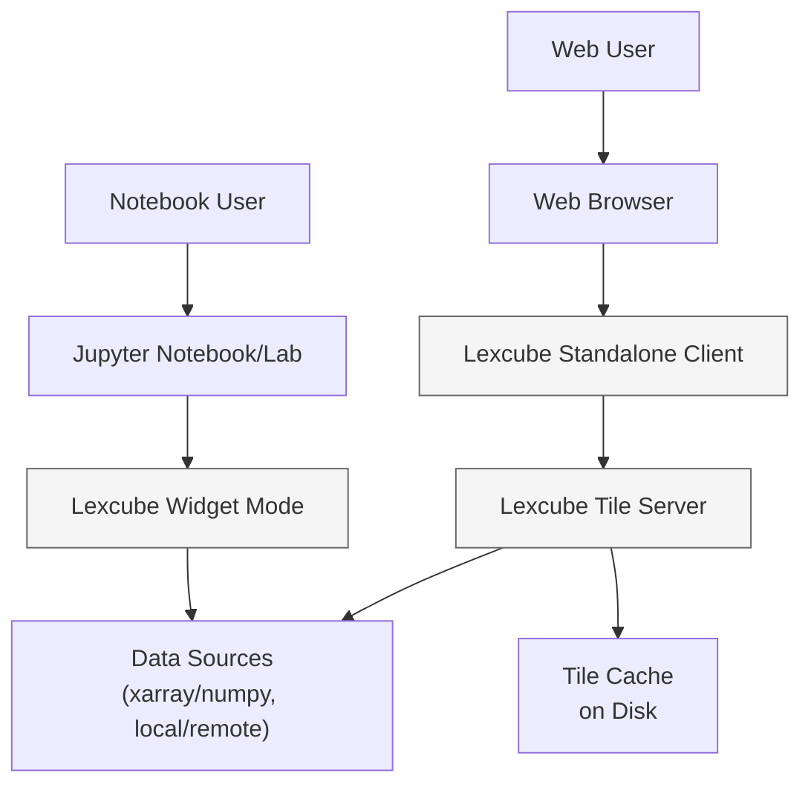

# Context

Lexcube is an interactive 3D data cube visualization system with two runtime modes:

- Widget mode inside Jupyter (Python + ipywidgets + JS/TS frontend).
- Standalone mode (browser client + WebSocket tile server).

Primary users

- Notebook users who visualize 3D numpy/xarray data in Jupyter.
- Web users who explore preconfigured datasets in a standalone web client.
- Developers who build and release widget extensions and the client bundle.

External systems

- Jupyter Notebook/JupyterLab runtime and widget manager.
- Web browser with WebGL2/WebSocket/WebAssembly.
- Data sources: local files, Zarr/NetCDF, remote object stores (S3), HTTP datasets.
- Optional filesystem cache for pre-generated tiles in standalone mode.

System context (C4 L1)

Key quality attributes

- Interactive performance for large datasets using tiling, compression, and caching.
- Consistent visualization semantics across widget and standalone modes.
- Reproducible builds for Jupyter extensions and client bundles.
