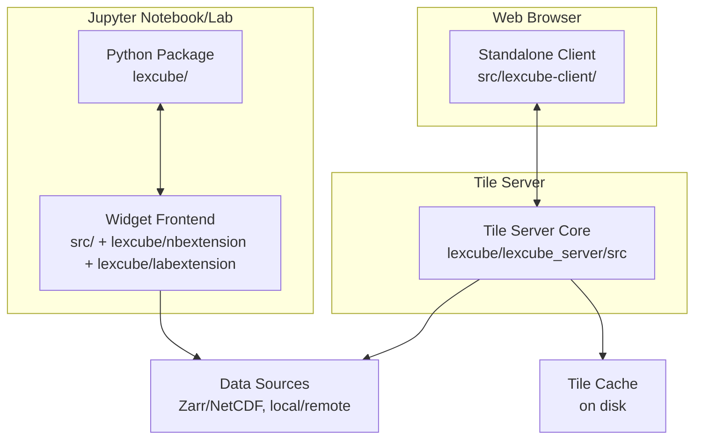

# Containers

This section describes the main runtime containers and their responsibilities.

Containers (C4 L2)

Container responsibilities

- Python package (`lexcube/`): public API for notebooks, widget model, traitlets sync, and widget-mode tile server startup.
- Widget frontend (`src/`): Jupyter widget view/model, links UI to the client rendering/interaction engine.
- Standalone client (`src/lexcube-client/`): browser UI and rendering stack, connects to tile server via WebSocket.
- Tile server core (`lexcube/lexcube_server/src/`): dataset loading, tiling, compression, caching, metadata discovery.

Entry points

- Python API: `lexcube/cube3d.py` (`Cube3DWidget`, `Sliders`).
- Widget frontend: `src/widget.ts` (model/view), `src/extension.ts` (nbextension entry).
- JupyterLab plugin: `src/plugin.ts` (registry integration).
- Client app: `src/lexcube-client/src/client/client.ts`.
- Tile server core: `lexcube/lexcube_server/src/tile_server.py` and `lexcube/lexcube_server/src/lexcube_widget.py`.
