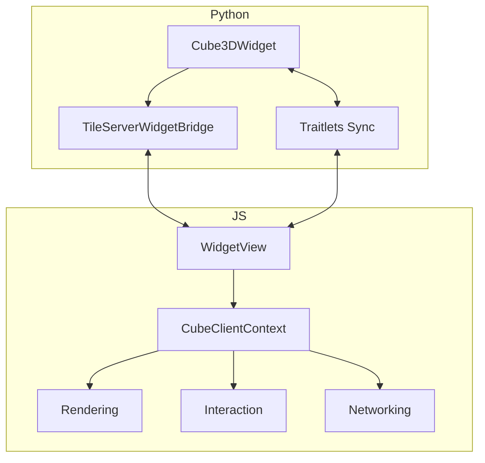

# Components: Widget Mode

Widget mode runs entirely inside the Jupyter runtime and uses the ipywidgets channel for communication.

Key components

- Python widget API: `lexcube/cube3d.py` (`Cube3DWidget`, `Sliders`).
- Widget tile server bridge: `lexcube/lexcube_server/src/lexcube_widget.py`.
- Widget frontend model/view: `src/widget.ts`.

Python widget (`Cube3DWidget`)

- Accepts `numpy.ndarray` or `xarray.DataArray` with exactly three dimensions.
- Starts an in-process tile server via `start_tile_server_in_widget_mode`.
- Publishes metadata (`api_metadata`) and reactive state via traitlets (`vmin`, `vmax`, `cmap`, `xlim`, `ylim`, `zlim`, wrap flags, camera, etc.).
- Provides helper APIs (`plot/show`, `show_sliders`, `overlay_geojson`, `savefig`, `save_print_template`).

Widget mode tile server bridge

- Validates data, patches dataset orientation where needed, and derives dimension labels.
- Implements the request/response loop by subscribing to widget messages and emitting tile data buffers.
- Exposes dataset metadata to the JS frontend through `api_metadata`.

Frontend widget view/model

- `Cube3DModel` defines the widget model metadata and serializers.
- `Cube3DView` renders the HTML template and embeds the `CubeClientContext` in widget mode.
- Bridges widget messages to the client network layer and handles responses:
  - tile requests -> `requestTileDataFromWidget` -> Python tile server
  - responses -> `onTileData` -> render pipeline
  - figure/print downloads -> rendering utilities
- Keeps bidirectional sync between the widget model and the client state:
  - colormap, selection ranges, camera, wrap settings, and progress.

Widget mode component relationships

Notes

- Widget mode uses in-process tile generation and memory cache, with optional chunk caching for xarray inputs.
- Progress reporting is derived from touched chunks or tile counts (`request_progress`).
