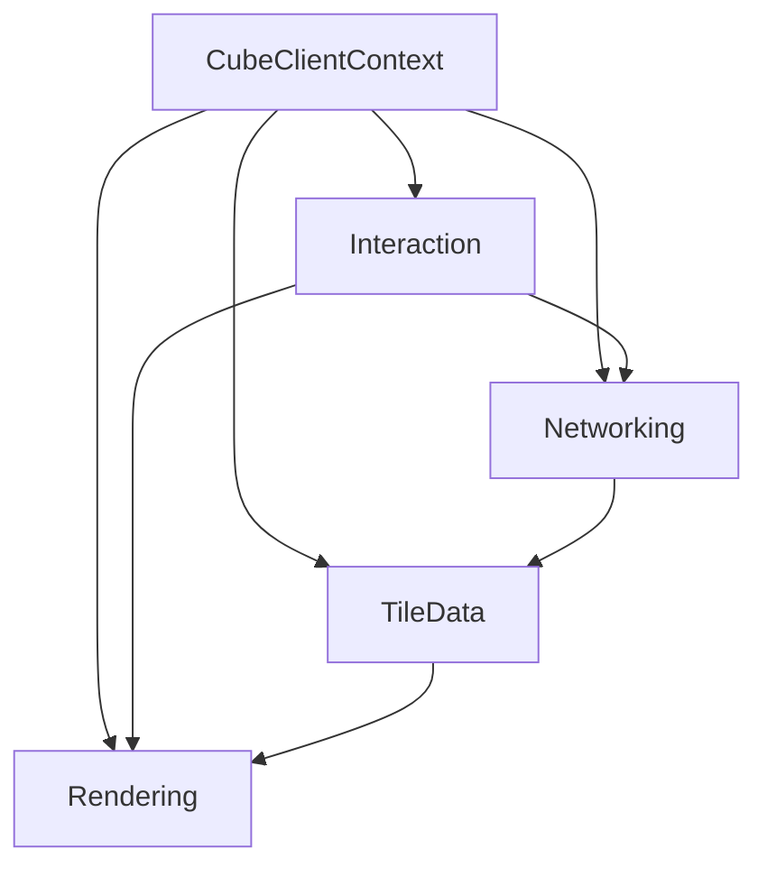

# Components: Client (Browser)

The client runs in the browser and is shared by widget and standalone modes. In widget mode it is embedded in the Jupyter output area and uses the widget message channel for tiles; in standalone mode it connects to the tile server via WebSocket.

Key modules

- `src/lexcube-client/src/client/client.ts` (`CubeClientContext`).
- `src/lexcube-client/src/client/interaction.ts` (UI, selection, controls).
- `src/lexcube-client/src/client/rendering.ts` (Three.js rendering pipeline).
- `src/lexcube-client/src/client/networking.ts` (WebSocket + widget transport).
- `src/lexcube-client/src/client/tiledata.ts` (tile decode, texture caches, colormap).

Core components

- `CubeClientContext`
  - Orchestrates `Rendering`, `Interaction`, `Networking`, and `TileData`.
  - Detects runtime features (WebGL2/WebSocket/WebAssembly).
  - Supports multiple modes via URL flags (debug, expert, studio, noUi, scripted, orchestration).

- Rendering (`rendering.ts`)
  - Three.js scene setup, shaders, textures, and camera modes.
  - Exports screenshots and animations (PNG/WebM/MP4/GIF).
  - Applies cube scaling, UI overlays, and legend/axes.

- Interaction (`interaction.ts`)
  - Handles selection ranges, camera movement, sliders, and user input.
  - Manages dataset/parameter selection and UI states.
  - Integrates colormap and animation controls.

- Networking (`networking.ts`)
  - Standalone: WebSocket (`socket.io`) connection to tile server.
  - Widget: relays requests via widget messaging (`requestTileDataFromWidget`).
  - Maintains a tile response cache for the session.

- Tile data (`tiledata.ts`)
  - Decodes tile payloads, handles compression (ZFP/Blosc/LZ4) and NaN masks.
  - Manages GPU textures and LOD tile storage.
  - Tracks statistical colormap bounds and download metrics.

Client component relationships

