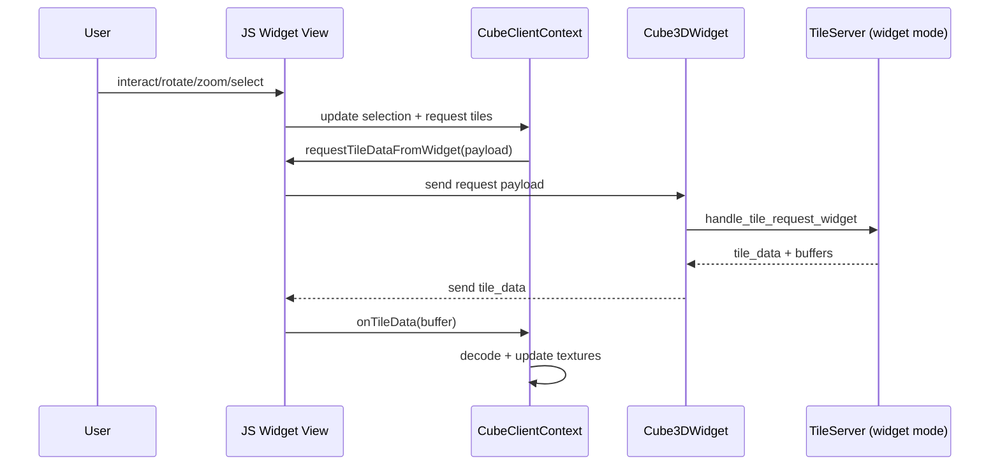
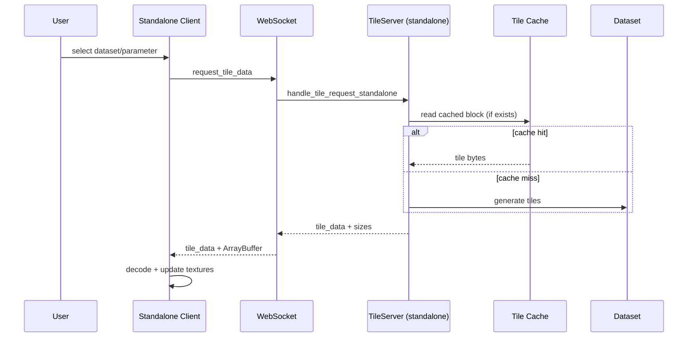

# Data Flow

Two primary flows: widget mode (Jupyter) and standalone mode (browser + server).

Widget mode tile flow

Standalone mode tile flow

Metadata flow (widget mode)

- Python `start_tile_server_in_widget_mode` computes metadata and pushes it to `api_metadata`.
- Widget view fetches metadata via `fetchMetadataFromWidget` to populate cube/parameter lists.

Compression and tile format

- Tiles are compressed with ZFP (lossy) or Blosc/LZ4 (lossless + NaN masks).
- Tiles are versioned and prefixed with magic bytes (`lexc`) to validate payloads.
